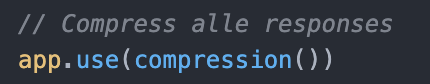

# 

## Table of contents
  - [Table of contents](#table-of-contents)
  - [About](#about)
  - [Features](#features)
  - [API documentation](#API-documentation)
  - [Installing](#installing)
  - [Author](#author)
  - [To-do](#To-do)
  - [Contributing](#contributing)
  - [License](#license)

## [Live demo](https://rijks-library.herokuapp.com/)


## About
**Rijks Library is een web applicatie waarmee je kunstwerken van het Rijksmuseum kunt zoeken en bekijken. Je kunt je favoriete kustwerken opslaan, zodat je deze later kan bekijken. Ook offline.**

Deze web app maakt gebruik van de Rijksmuseum API. Deze haalt op basis van een zoekopdracht kunstwerken op uit hun database. 


## Features
|                                                                   |     |
| ----------------------------------------------------------------- | --- |
| 🔍  Zoek jouw favoriete kunstwerken uit de Rijksmuseum collectie! | ✔   |
| 🖼️  Lees informatie over de kunstwerken                           | ✔   |
| ⭐  Sla je favoriete kunstwerken op	                            | ✔   |
| 💾  Cached pagina's voor een snellere ervaring                    | ✔   |
| 🎨  Filter op jouw voorkeuren **COMING SOON**                     |     |

## Client & server side rendering
Voor deze app heb ik als basis server side rendering gebruikt. Bij server side rendering worden alle dynamische content op de server gerenderd. Deze kan vervolgens als 'simpele' html naar de client side gestuurd worden. 

Door al het denk- en rekenwerk op de server te doen, zal de FCP (First content paint) en LCP (Largest content paint) sneller zijn voor de bezoeker. Dit is dus beter voor de performance van je site. Zie ook [Critical render path](#Critical-render-path)


!!Flexen over hoe server werkt bij mij en waarom


## Job Stories - Service Worker
1. Als bezoeker van Rijks Library wil ik de homepagina offline kunnen bekijken, zodat ik altijd (snel) wat kunst kan zien, zonder dat ik internet heb. (Als je minstens 1x de site hebt bezocht mét internet)
2. Als bezoeker van Rijks Library wil ik mijn gezochten detail resultaten in cache hebben opgeslagen, als dit niet teveel geheugen kost, zodat ik deze sneller kan bekijken.

## Activity Diagram

### Server


### Service worker
Ik heb voor de caching strategie 'stale while revalidate' gekozen. Deze strategie houdt in dat als het request vanuit de caching geladen kan worden, dit gedaan wordt. Vervolgens wordt er in de achtergrond een nieuwe fetch gedaan om deze op te slaan in de cache, zo blijft je site toch up to date met een delay van 1 refresh. 

Dit is mooi, aangezien je zo pagina's snel vanuit cache kan laten zien, als deze beschikbaar is, en deze meteen up to date blijft.


### Client


## Critical render path
Om de performace van mijn site te verbeteren heb ik bepaalde technieken gebruikt:

### Minify
In mijn build scripts laat ik door minifiers mijn CSS & JS heel compact geschreven worden. Zo is het bestand kleiner door de weinig regels en karakters.


### Compress
Ik gebruik compress om alle files en items die gebruikt worden in file size te verminderen. 



### Font-display: swap
Font display: swap zorgt ervoor dat je custom fonts in de achtergrond kunt laden terwijl er tot die tijd een fallback font wordt laten zien. Dit verbetert de performance zodat het font het laden niet blokkeert

### Images
Om de images te verbeteren hebn ik srcset toegevoegd. De browser kan met deze verschillende formaten de beste optie kiezen voor de context waarin deze zich begeeft. Bij traag internet zou de browser dus kunnen kiezen voor een kleinere foto, waardoor deze sneller wordt geladen. Sizes instellen helpt de browser om deze keuze beter te kunnen maken.


Ook het toevoegen van een height en width aan img-tags verbeterd de performace. Zo zijn er namelijk minder layout shifts. Dit is beter voor de performance.


### Resultaat:
**Before:**


**After:**


## API documentation
Voor deze web app heb ik gebruik gemaakt van de Rijksmuseum API. De documentatie van deze API is hier te vinden: [Rijksmuseum API](https://data.rijksmuseum.nl/object-metadata/api/)

Uit de API haal ik de volgende data op:

- Naam kunstwerk
- ID kunstwerk
- Image
- Kunstenaar
- Jaartal
- Materiaal
- Beschrijving kunstwerk

## Installing
Clone deze repository naar jouw lokale folder
```
git clone https://github.com/jornveltrop/progressive-web-apps-2122.git
```
<br>

Stel jouw API key in via de [Rijksstudio](https://www.rijksmuseum.nl/nl/rijksstudio)

## Author
De maker van deze app is: [*Jorn Veltrop*](https://github.com/jornveltrop)

## To-do
|                     |  |
| :------------------------------ | :---- |
| API connectie                   | ✅    |
| Data ophalen van  API           | ✅    |
| Ideal state                     | ✅    |
| Error state                     | ✅    |
| Detail page                     | ✅    |
| Favoriete kunstwerken opslaan   | ✅    |
| Filter functie                  |       |
| Reload button op error page     |       |
| Suggesties tijdens zoeken       |       |
| Caching ends instellen          |       |


## Contributing
Als je wilt bijdragen aan deze app kun je dat doen door middel van een [Issue](https://github.com/jornveltrop/progressive-web-apps-2122/issues).


## License
Dit project valt onder de MIT [license](https://github.com/jornveltrop/progressive-web-apps-2122/blob/main/LICENSE).